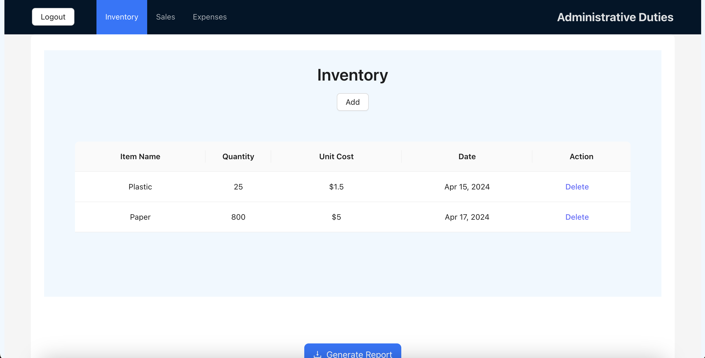

# humphrey-fellowship-capstone
A financial tracking app for microvendors to track their expenses and sales to act as records for applying for loans

# Demo
[Video Walkthrough](https://drive.google.com/file/d/13l9L8sjzHtablX2nHJI-AAPQDThATLUJ/view?usp=sharing)

# Features
- User Authentication/Authorization
- Inventory Management functionality
- Intelligent Sales Entry
- Auto Populated Expense Logging
- Download Data into Excel functionality 

## How to Run
### In client

`npm install`

`npm run dev`

### In server
`npm install`

`node server.js`